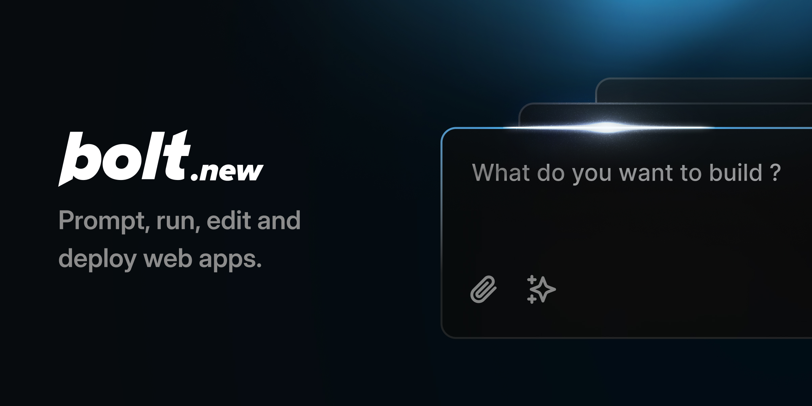

[](https://bolt.new)

# Gleio AI: Your AI Co-Founder for Startup Success

**From idea validation to code generation to launch strategy. Build and ship your startup in days, not months.**

Gleio AI is your comprehensive AI co-founder that guides you through every phase of startup creation, from initial concept validation to scaling your business. Powered by the open-source Bolt.new codebase, it combines deep market research, business validation, and production-ready development in one powerful platform.

## 🚀 What Makes Gleio AI Different

Unlike other AI coding assistants, Gleio AI is designed specifically for entrepreneurs and startup builders:

- **🔍 Deep Market Research**: Comprehensive market analysis and competitor research before building
- **✅ Idea Validation**: Rigorous business model validation and customer discovery
- **💻 Production-Ready Development**: Full-stack applications with modern frameworks and best practices
- **📊 Business Intelligence**: Data-driven insights for go-to-market strategy and growth
- **🎯 Launch Strategy**: Complete roadmap from MVP to market entry

## 🎯 Complete Startup Journey

### Phase 1: Idea Validation & Research
- **Market Research**: Deep analysis of market size, trends, and opportunities
- **Competitive Analysis**: Comprehensive competitor landscape and positioning research
- **Customer Validation**: Target audience research and pain point analysis
- **Business Model Design**: Revenue model recommendations and pricing strategy
- **Risk Assessment**: Potential challenges and mitigation strategies

### Phase 2: MVP Development
- **Technical Architecture**: Scalable, production-ready code structure
- **Modern Stack**: React, Next.js, TypeScript, Tailwind CSS, and more
- **Business Features**: User auth, payments, analytics, and growth tools
- **Conversion Optimization**: Landing pages and user flows designed for growth
- **Mobile-First Design**: Responsive, accessible, and performant interfaces

### Phase 3: Launch & Growth
- **Go-to-Market Strategy**: Customer acquisition and marketing plans
- **Analytics Integration**: User behavior tracking and business metrics
- **Growth Mechanisms**: Referral systems, A/B testing, and viral features
- **Customer Success**: Support systems and feedback collection
- **Scaling Preparation**: Infrastructure and team growth planning

## 🛠️ Technology Excellence

### Frontend Frameworks
- **Next.js 14+** with App Router and Server Components
- **React 18+** with modern hooks and concurrent features
- **Vue 3** with Composition API for complex UIs
- **TypeScript** for production stability and developer experience

### Styling & Design
- **Tailwind CSS** for rapid, consistent development
- **Modern Component Libraries** (Shadcn/ui, Radix UI, Chakra UI)
- **Responsive Design** with mobile-first approach
- **Accessibility** following WCAG guidelines

### Backend & Database
- **Next.js API Routes** and Server Actions
- **Prisma ORM** for type-safe database operations
- **Authentication** with NextAuth.js and OAuth providers
- **Payment Processing** with Stripe integration

### Business Tools Integration
- **Analytics** with built-in tracking and conversion metrics
- **Email Marketing** automation and customer communication
- **A/B Testing** framework for continuous optimization
- **Customer Support** systems and feedback collection

## 📈 Startup-Specific Features

Every application includes business-critical features:

- **Landing Pages** optimized for conversion and SEO
- **User Onboarding** flows designed for activation and retention
- **Subscription Management** with Stripe integration
- **Admin Dashboards** for business operations and analytics
- **Growth Tools** including referrals and social sharing
- **Customer Feedback** collection and analysis systems

## 🎨 Beautiful, Conversion-Optimized Design

- **Modern UI/UX** following the latest design trends
- **Conversion Optimization** with proven design patterns
- **Trust Signals** and social proof integration
- **Performance Optimization** for better user experience
- **Cross-Platform Compatibility** ensuring broad reach

## 🚀 Example Startup Types

Gleio AI excels at creating various types of startups:

### SaaS Platforms
- Project management tools for remote teams
- Marketing automation platforms
- AI-powered productivity tools
- Customer relationship management systems

### Marketplaces
- Service provider platforms
- B2B software marketplaces
- Local services connections
- Specialized industry marketplaces

### E-commerce Solutions
- Direct-to-consumer brands
- Subscription box services
- Digital product stores
- Marketplace integrations

### Fintech Applications
- Payment processing solutions
- Financial planning tools
- Investment platforms
- Cryptocurrency services

### HealthTech Platforms
- Telemedicine applications
- Health tracking systems
- Medical practice management
- Patient portal solutions

## 💡 Perfect Prompts for Startup Success

### Idea Validation Example
```
"I have an idea for a SaaS platform that helps remote teams manage projects more effectively. Can you help me validate this through market research, analyze competitors like Asana and Monday.com, assess the target market size, and create a business plan with revenue projections?"
```

### Full Startup Creation Example
```
"Create a marketplace connecting freelance graphic designers with small businesses. Include comprehensive market research, competitor analysis, two-sided platform features, payment processing, rating systems, and a go-to-market strategy."
```

### Business Model Validation Example
```
"Validate and create a subscription-based AI writing tool for content marketers. Research the market opportunity, analyze competitors, validate customer demand, and build an MVP with user authentication and subscription billing."
```

## 🏗️ Development Environment

Built on modern web technologies optimized for the WebContainer environment:

- **Node.js Runtime** with full npm ecosystem support
- **Vite** for lightning-fast development and optimized builds
- **Hot Module Replacement** for instant feedback during development
- **TypeScript Integration** for type safety and better developer experience
- **ESLint & Prettier** for consistent code quality

## 🌟 Business Validation Process

1. **Market Analysis**: Deep research into market size, trends, and opportunities
2. **Competitor Research**: Comprehensive analysis of direct and indirect competitors
3. **Customer Discovery**: Target audience research and pain point validation
4. **Technical Feasibility**: Assessment of development complexity and requirements
5. **Business Model**: Revenue model analysis and pricing strategy recommendations
6. **Risk Assessment**: Identification of potential challenges and mitigation strategies
7. **MVP Planning**: Feature prioritization and development roadmap
8. **Launch Strategy**: Go-to-market planning and customer acquisition strategy

## 🎯 Success Metrics & Analytics

Every startup includes comprehensive analytics and success tracking:

- **User Acquisition Metrics** (CAC, organic growth, referrals)
- **Engagement Analytics** (DAU, session duration, feature usage)
- **Conversion Tracking** (signup rates, trial-to-paid, churn)
- **Revenue Metrics** (MRR, LTV, growth rate)
- **Product Analytics** (feature adoption, user flow analysis)

## 🔧 Getting Started

1. **Describe Your Idea**: Share your startup concept or business idea
2. **Research Phase**: Get comprehensive market and competitive analysis
3. **Validation Report**: Receive detailed business validation insights
4. **MVP Development**: Build a production-ready application
5. **Launch Strategy**: Get go-to-market planning and growth tactics

## 📚 Additional Resources

- [Full-Stack Website Creation Guide](./WEBSITE_CREATION_GUIDE.md)
- [Contributing to the Project](./CONTRIBUTING.md)
- [Business Validation Templates](./docs/validation-templates.md)
- [Launch Strategy Playbook](./docs/launch-strategies.md)

---

**Ready to build your startup?** Get started with Gleio AI and turn your idea into a successful business with comprehensive validation, production-ready code, and strategic guidance.

*Powered by the open-source Bolt.new codebase with enhanced startup co-founder capabilities.*
